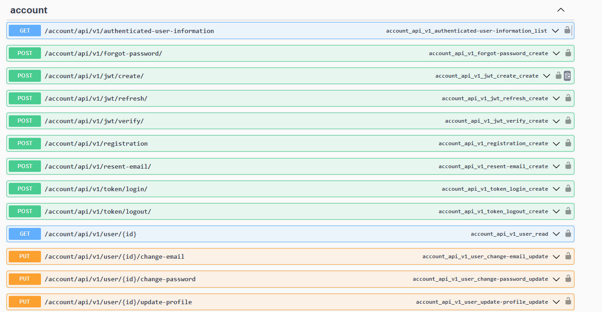
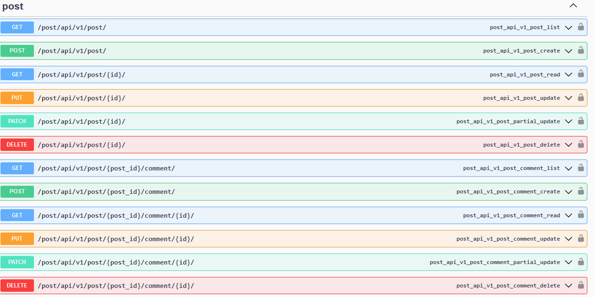
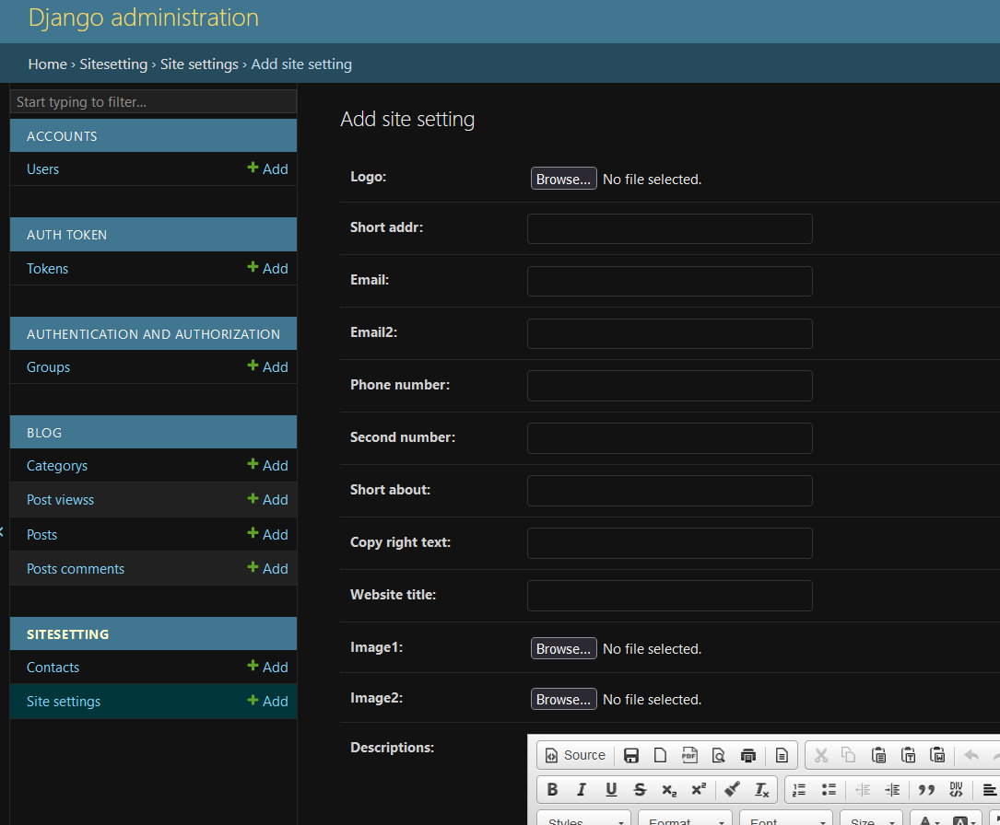

<h1  align="center" style='font-size:50px; '>Post Hub WebSite</h1>

<h2 align="center" style='font-size:30px'>
This is a Simple Website for posts and news That allow the users to read and create posts
</h2>
<p align="center">


</p>


# DEMO : Simple Intro With main part of website
<br>


<br><br>

## Swagger Page




<br><br>

# Database Schema

### the provided schema is the main database design of the project based on the models we have used in django project.


<br>

### Online Database Schema on This [Link](https://viewer.diagrams.net/?tags=%7B%7D&lightbox=1&highlight=0000ff&edit=_blank&layers=1&nav=1&title=exported_from_idea.drawio#Uhttps%3A%2F%2Fdrive.google.com%2Fuc%3Fid%3D1PcFByIyC-XnPf3vJ5RuUefoIvGKYrago%26export%3Ddownload)

<br>


# Installation

## 1 .Install Docker 
<h3> For Install Docker in linux or windows use this  <a href='https://docs.docker.com/desktop/setup/install/linux/'>link</a> </h3> 

<br>

## 2. Get The project

### for get the project just clone it from Github or you can use the below code
#### Just copy and past in terminal or CMD 

``` bash
git clone https://github.com/maryus1991/ADV_Blog.git
```

## 3. Start The project 
### For setup and Start the project just run the Below code in terminal or CMD

``` bash
docker compose up --build -d 
```
#### its may take a time to build and run the project 
#### NOTE : Run This code in the directory the cloned the project
 
<br><br>

## 4.Setup The Project
<br>

### First you need to migrate and by run migrate command project database will setup
```bash
docker compose exec blog sh -c 'python manage.py makemigrations'
```
```bash
docker compose exec blog sh -c 'python manage.py migrate'
```

### Then create the admin user for setup default setting for site
```bash
docker compose exec blog sh -c 'python manage.py createsuperuser'
```
### NOTE: After running the command you should enter email and password 

<br>

### 5.Setup the Default Information

#### First you Should to run the following command for create test posts

```bash
docker compose exec blog sh -c 'python manage.py fake_blog enter@your.email'
```
#### NOTE: Enter your email , replace enter@your.email with your email

<br>

#### Secund you should enter the admin page in the following link  
##### Enter the link to your browser 

```url
localhost:8000/admin/SiteSetting/sitesetting/add/
```



#### As you see in the above image  you should enter this kind of information 

<br>
<hr>

### And finally you should see the page in the following link
<br>


<br>

```
localhost:8000/
```

<br><br>

# Contact
<p style='font-size:20px'> I write all part of the project <br> For contact me just mail me at : <a href='mailto:maryus19915123@gmail.com'> maryus19915123@gmail.com </a> <br> </p>

<br><br>

# License
[MIT](https://choosealicense.com/licenses/mit/)

# Bugs
Feel free to let me know if something needs to be fixed. or even any features seems to be needed in this repo.